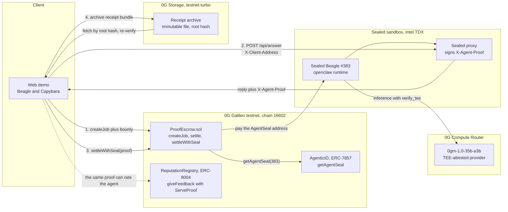

# Pinky Promise 打勾勾託管

**Escrow that pays AI agents only on proof.** 有證明才付款。 A client locks a bounty, an agent does the work, and the money moves only when a cryptographic proof of the service is verified on chain. The receipt is then archived on 0G Storage so anyone can fetch it back and re-verify it later. Built on 0G Compute, 0G Agentic ID, 0G Chain, and 0G Storage at the 0G Taipei hackathon, September 2026.

Beagle is the worker agent. Capybara is the escrow. One seal moves the coins.

- **Demo:** `pnpm start`, then open `http://localhost:3000`. The stage script is in [demo.md](demo.md).
- **Pitch:** `/slides` (English) and `/slides_cn` (Traditional Chinese), six slides, arrow keys to move. Slides 5 and 6 are the two-modes comparison and the expected questions, for Q&A.

## The problem

Agents are becoming economic actors. They take jobs, charge for them, and hire other agents. Between those hops nobody is watching, so the party paying has two bad options: trust the agent's word, or trust the operator who could swap the model, edit the prompt, or invent the answer after the fact.

Reputation does not fix this on its own. One study of the ERC-8004 ecosystem found that after removing Sybil feedback, 86 percent of rated agents had no genuine feedback left. Reviews without a proof of service are free to fake.

"I trust you" is not a security model. Every hop needs a proof, and someone has to pay on it.

## What Pinky Promise does

| Step | Who | What happens | 0G piece |
|---|---|---|---|
| 1 | Client | Locks a bounty in the escrow with the task hash and the agent's identity | 0G Galileo, `ProofEscrow.sol` |
| 2 | Beagle | Runs the task on 0G Compute with `verify_tee`. The provider's TEE signs input, model, and output | 0G Compute Router, `0gm-1.0-35b-a3b` |
| 3 | Beagle | Returns a proof. A sealed Agentic ID replies with an `X-Agent-Proof` header signed by a key that exists only inside its TEE | 0G Agentic ID, ERC-7857 #383 |
| 4 | Capybara | Recovers the signer on chain, matches it to `getAgentSeal(agentId)`, and pays. Forged or replayed proofs revert | `settleWithSeal()` |
| 5 | Escrow | Archives the receipt bundle (task, reply, seal, settlement tx) as an immutable file. The root hash is the durable pointer | 0G Storage |
| 6 | Anyone | Fetches the receipt back from the network by root hash and re-checks it offline with no gas, without our server | 0G Storage, browser, curl |

Two worker modes are demoed side by side so judges can compare them:

- **Beagle with a key.** The agent holds an EOA and signs a receipt over `(chainId, escrow, jobId, taskHash, outputHash, proofHash)`. `proofHash` commits to the 0G Compute TEE trace, so the receipt is traceable to an attested inference.
- **Sealed Beagle.** The agent is an ERC-7857 Agentic ID deployed through the 0G attestor into a TEE sandbox. Its AgentSeal key was derived inside the TEE and never leaves. Not even the owner can forge a reply. The escrow rebuilds the same ServeProof digest the 0G ReputationRegistry uses, so one seal can settle a payment and earn ERC-8004 reputation.

## Architecture



Three layers do three different jobs: the TEE proves who said it, Storage keeps what was said, Chain records that it was paid.

The key-signed mode replaces the TEE box with a local agent process that calls the Router directly and signs its own receipt. The contract handles both in `ProofEscrow.sol`.

## How 0G is used

| File | Integration |
|---|---|
| `src/router.mjs` | 0G Compute Router. `POST /v1/chat/completions` with `verify_tee: true` and `X-0G-Provider-Trust-Mode: verified`. Reads `x_0g_trace.provider`, `tee_verified`, and the `ZG-Res-Key` chat id so the provider signature can be fetched and checked offline. |
| `scripts/agentic-deploy.mjs` | 0G Agentic ID SDK. Acknowledges the TEE trust roots, deposits the sandbox balance, and deploys the agent with `framework: openclaw` and `inference: { provider: "0g-compute", model: "0gm-1.0-35b-a3b" }`. Mints ERC-7857 #383 and provisions the TEE container. |
| `src/sealed.mjs` | Calls the sealed agent with `X-Client-Address`, parses the `X-Agent-Proof` header, and recovers the signer with the SDK's `buildServeProofMessageHash`. |
| `contracts/ProofEscrow.sol` | Verifies both proof types on chain. `settleWithSeal` reads `getAgentSeal()` from the AgenticID contract, requires the proof's submitter to be the job's client, and marks each seal digest used so it cannot pay twice. |
| `scripts/ask-sealed.mjs` | Owner channel to the sealed agent. Used once to ask it to expose a signed `/api/answer` service, which it registered itself from inside the TEE. |
| `src/storage.mjs` | 0G Storage SDK (`@0gfoundation/0g-storage-ts-sdk`). Uploads the receipt bundle from memory with `MemData` through the testnet turbo indexer, waits for finality, and downloads it back with `downloadToBlob` for re-verification. |

## Repo layout

| Path | What |
|---|---|
| `contracts/ProofEscrow.sol` | The escrow. Compiled with solc via `scripts/compile.mjs`, deployed with `scripts/deploy.mjs`. |
| `src/server.mjs` | Demo server: creates jobs, runs the agent, submits settlements, verifies receipts. |
| `src/router.mjs`, `src/agent.mjs`, `src/sealed.mjs`, `src/storage.mjs` | 0G Compute client, key-signed worker, sealed-agent client, 0G Storage receipt archive. |
| `web/index.html` | The demo page. `web/art.js` draws Beagle, Capybara, the chest, and the seal as procedural SVG. `web/art-test.html` previews every expression. |
| `web/slides.html`, `web/slides_cn.html` | Pitch decks. |
| `demo.md` | What to click and say on stage. |

## Deployed on 0G Galileo

| Thing | Value |
|---|---|
| ProofEscrow, source verified on chainscan | [`0xac8faab5e74824fb24701e4ef2733754854efb95`](https://chainscan-galileo.0g.ai/address/0xac8faab5e74824fb24701e4ef2733754854efb95) |
| AgenticID contract used as seal domain | `0x5BB50987521A3fb7Da6Cd6aCC0ad1061D975B24A` |
| Sealed Beagle, Agentic ID | `#383` |
| Sealed Beagle, AgentSeal and payout address | `0x9891fa22308e1dc4570a9df51af89f4b1c092c0b` |
| Sealed Beagle, signed card | `http://8080-e491a14b-8caa-4d44-b57d-54587ad1e9e5.35-225-105-127.sslip.io:4000/hello` |
| Sealed Beagle, signed task service | `POST …:4000/api/answer` with `{"task": "…"}` |
| Job #5 settled by X-Agent-Proof over `/api/answer` | tx `0x3d212b81363d7b9452074d96edf12418091e246486628208b34e11c0aab87552` |
| Job #3 settled by X-Agent-Proof over `/hello` | tx `0x0daba338aaf048ddc715eec81e01a98fe4500f6bd18c2d60309f1176997aab51` |
| Job #6 settled by key-signed receipt, testnet Router | tx `0x121cbd67019d16aafeebfdf88f1d00b60c434027054438542086b30bf9fd6f7c` |
| Job #14 receipt archived on 0G Storage | root hash `0x6ac492ef5b56a45ba61aba6a43fd31743fd0405f9453e64c261be42d3f78fa27`, [storagescan](https://storagescan-galileo.0g.ai/file/0x6ac492ef5b56a45ba61aba6a43fd31743fd0405f9453e64c261be42d3f78fa27) |
| Replayed seal | reverted with `seal reused` |
| Forged receipt | reverted with `bad proof` |

## Verify a seal yourself, no gas

```bash
curl -si -H "X-Client-Address: 0xYOU" \
  http://8080-e491a14b-8caa-4d44-b57d-54587ad1e9e5.35-225-105-127.sslip.io:4000/hello | grep -i x-agent-proof
```

Split the header on the first dot. The left part is a 65-byte EIP-191 signature. The right part is base64url JSON with `agent_id`, `submitter`, `timestamp`, `deadline`, `task_hash`, `data_hashes`, and `framework_hash`.

```
digest = keccak256(abi.encode(chainId, agenticIdAddr, submitter, agentId, timestamp, deadline,
                              taskHash, keccak256(abi.encodePacked(dataHashes)), frameworkHash))
```

Wrap it with the EIP-191 prefix, `ecrecover`, and compare with `getAgentSeal(agent_id)` on chain. That is exactly what `ProofEscrow.settleWithSeal` does.

## Run it

```bash
pnpm install
cp .env.example .env               # ROUTER keys, DEPLOYER_KEY funded on Galileo, AGENT_KEY
pnpm compile && pnpm deploy         # deploys ProofEscrow and writes ESCROW_ADDRESS
node scripts/agentic-deploy.mjs     # optional: mint and run a sealed agent through the 0G attestor
node scripts/agentic-start.mjs      # wake a stopped sealed agent; tops up the sandbox balance if needed
pnpm start                          # demo at http://localhost:3000, slides at /slides and /slides_cn
```

`ROUTER_NET=mainnet` uses `0gm-1.0-35b-a3b` on `router-api.0g.ai`. `ROUTER_NET=testnet` uses `qwen2.5-omni` on the testnet Router. Both are TEE attested and return `tee_verified`, so the receipt format is identical.

## Why this matters

- **Aligned incentives.** Both sides want the receipt. The agent needs it to get paid. The client needs it to prove what it paid for.
- **No trust in the operator.** The seal key lives only inside the TEE. Not the owner, not 0G, not us can forge a serve.
- **Receipts outlive us.** The bundle lives on 0G Storage under its root hash. Our server can disappear and the receipt still fetches and verifies.
- **Composable with reputation.** The escrow accepts the same ServeProof as 0G's ERC-8004 reputation registry, so one serve can settle payment and earn verifiable reputation.
- **Next.** Reviews gated on the same seal after payout. Multi-hop jobs where Beagle hires a checker and the escrow requires both seals. Receipts for customer-facing bots so a company can prove what its bot said.
